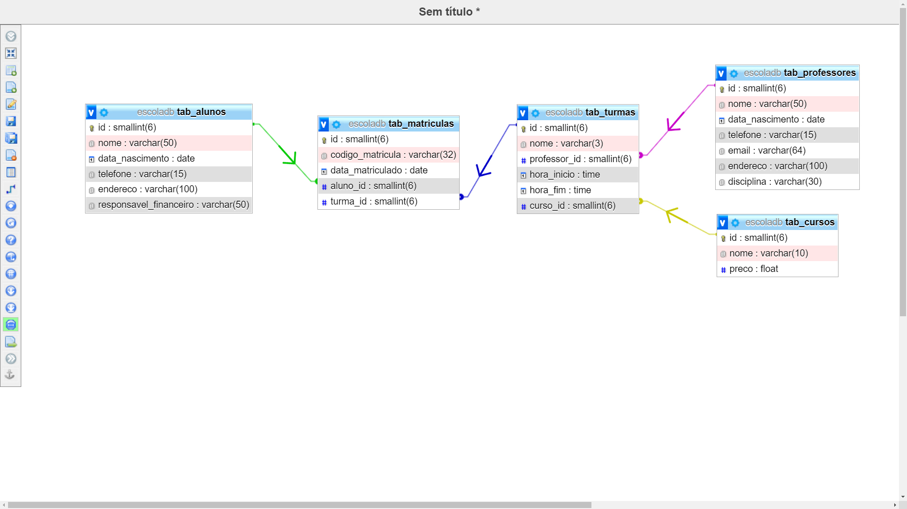

# 📝 Sistema de Gestão Escolar (Banco de Dados)

> ⚠️ **Código Legado:** Este projeto foi desenvolvido em **2021** como trabalho final do módulo de **Banco de Dados** do meu curso Full Stack. Ele é mantido aqui na sua forma original, servindo como um registro histórico do início da minha jornada na programação e dos meus primeiros passos na lógica de desenvolvimento.

## 🎯 O Desafio Proposto
O objetivo prático deste módulo era construir e estruturar um banco de dados relacional completo. Decidi cxonstruir o ecossistema de uma escola, englobando o registro de alunos, professores, cursos de Ensino Fundamental, turmas e o sistema de matrículas.

## 📊 Estrutura do Banco de Dados

## 🛠️ Tecnologias Utilizadas
* SQL (Structured Query Language)
* MySQL (PHPMyAdmin/XAMPP)

## 💡 Principais Aprendizados
*Este projeto foi fundamental na época para consolidar os seguintes conceitos:*
* **Modelagem Relacional:** Estruturei o banco dividindo as entidades em tabelas específicas (alunos, professores, cursos, turmas e matrículas). Garanti a integridade referencial utilizando chaves estrangeiras (FOREIGN KEY) para conectar turmas aos cursos e professores , e matrículas aos alunos e turmas.
* **Automação com Stored Procedures::** Encapsulei a lógica de inserção de dados criando rotinas automatizadas no banco (CREATE PROCEDURE), padronizando o cadastro de novos registros sem precisar repetir comandos longos.
* **Consultas e Cruzamento de Dados:** Desenvolvi relatórios avançados utilizando múltiplos INNER JOIN para extrair informações combinadas, como visualizar o nome do aluno atrelado à sua respectiva turma no momento da matrícula.
* **Buscas Parametrizadas:** Implementei procedures dinâmicas que recebem variáveis de entrada, permitindo filtrar resultados de forma customizada, como buscar turmas por professor , alunos por turma ou matrículas de um aluno específico.

## 🚀 Como Executar (Ambiente Local)
*(Instruções básicas para rodar o projeto)*
1. Clone o repositório completo.
2. Abra o seu Sistema de Gerenciamento de Banco de Dados (ex: MySQL Workbench).
3. Abra o script SQL deste repositório e execute-o por completo para gerar as tabelas, as procedures e popular o banco com os dados fictícios de exemplo.
4. Utilize os comandos CALL disponíveis no final do código para testar as consultas no seu ambiente.
